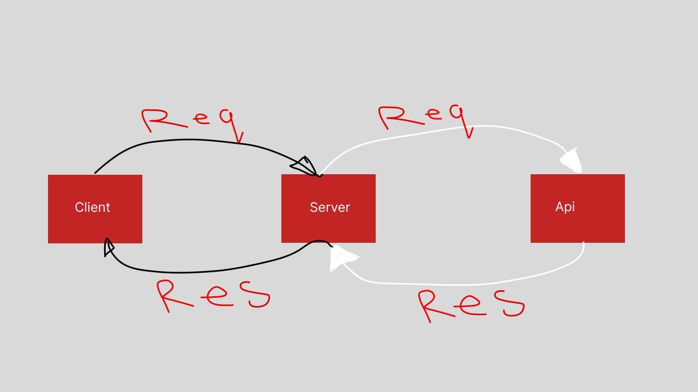
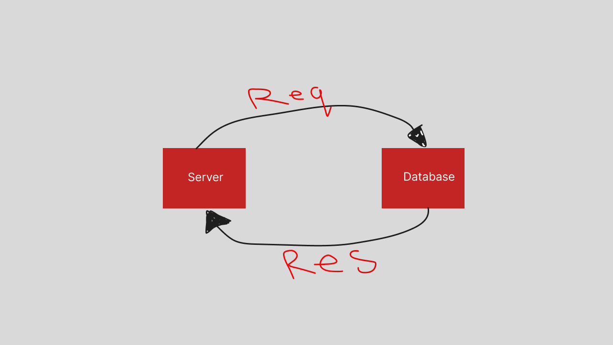

# Movies-Library 
**Author Name**: Mohammad Alghanim
## WRRC
## lab12

## lab13

## getting startee
# To run this in your machine clone the repository then run npm install in your trimnal after opening the directory make sure to navigate to myServer director
## Project fearures
# You can accses some Endpoints from the Movie DB API

