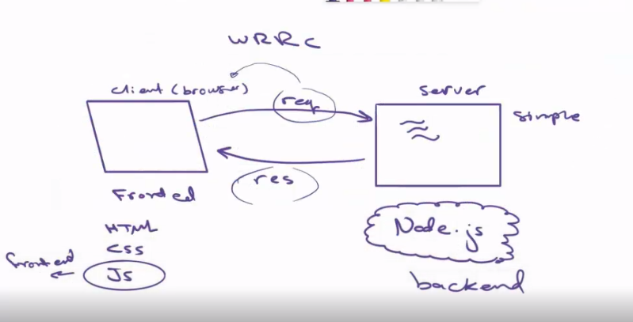

# Movies-Library 
**Author Name**: Mohammad Alghanim
## WRRC

# What are the steps that a user must take in order to build this app on their own machine and get it running?#
## first step doing the constructor then take a data from data.json and function to print it in server ##
#  What are the features included in you app  #
## update  it at any time ##